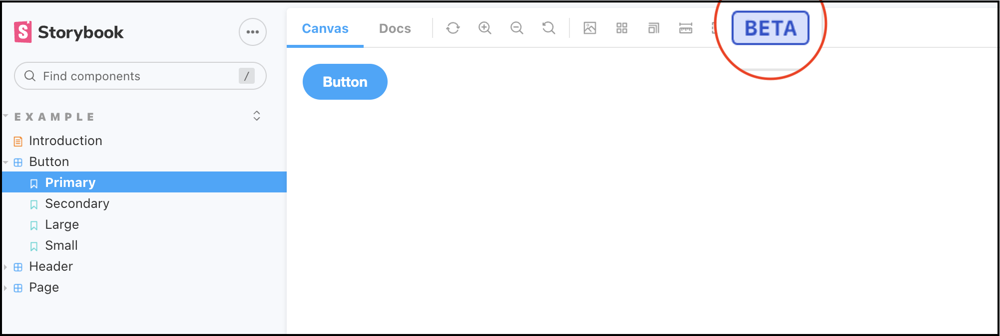

# Add Badges

You can add Badges to your Stories by using the `parameters` feature of Storybook.

You can add parameters at either an app-wide level, a Stories level, or an individual Story level. 

## Using JSX

You can add a badge to your Stories by passing an array of strings using 
the `parameters` key in your story exports.

```jsx title="my-component.story.js"
export default {
  title: 'Path/To/MyComponent',
  parameters: {
    badges: ['beta'],
  },
};
```

The `beta` badge should now appear in your top bar



## Using MDX

If you're using `mdx` then you can pass parameters in using your `<meta>` component:

```md title="my-component.stories.mdx"
<Meta title="Path/To/MyComponent" parameters={{ badges: ['beta'] }} />;
```

## Add badges to an individual story

If you'd like to add a badge to all of your stories, you can pass
parameters to all stories using your `preview.js`

```js title="my-component.stories.jsx"
export default {
    title: 'Example/Button',
    component: Button,
};

const Template = (args) => <Button {...args} />;

export const Primary = Template.bind({});
Primary.parameters = {
    badges: ['beta']    
}
```

:::danger Take care

The `storybook-addon-badges` addon can only read from a single set of parameters, 
As such, when you set badges on an individual story level, it'll override any 
other badges defined.

:::

## Add badges to all stories

If you'd like to add a badge to all of your stories, you can pass
parameters to all stories using your `preview.js` 

```js title=".storybook/preview.js"
addParameters({ badges: ['beta'] });
```

:::tip Tip

You can pass an empty array into the parameters for individual stories
to prevent global badges from showing.

:::
